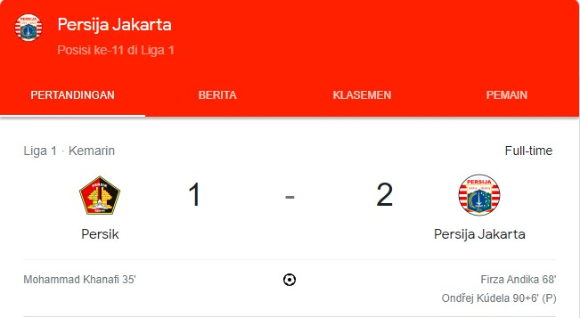

# Persija_Jakarta
Persija jakarta
<!DOCTYPE html>
<html>
<head>
	<meta charset="utf-8">
	<meta name="viewport" content="width=device-width, initial-scale=1">
	<title>BREAKING NEWS</title>
</head>
<body style="background-color: #ffeecc ">
<h1 style="color:black; background-color: rgb(200, 255, 0);">Persija Jakarta Come back lawan Persik Kediri</h1>
<h4 style="color:black;">Google menampilkan skor Persija Jakarta VS Persik Kediri, pada hari Minggu 17 September 2023</h4>

 Persija Jakarta tertinggal 1 poin dibabak pertama dengan skor Persik Kediri 1-0 untuk Persija Jakarta.

 Pertandingan ini berlangsung menarik dan cukup intens. Duel ini kemudian berakhir secara dramatis. <i> Pada babak pertama "Duel berlangsung terbuka. Persik Kediri dan Persija Jakarta saling adu serangan. Namun awalnya kedua tim cukup kesulitan menciptakan peluang berbahaya. Pada menit ke-22 peluang emas didapat oleh Fery Pahabol. Ia melepas tembakan melengkung dari sisi kiri luar kotak penalti Persija. Bola mengarah ke tiang jauh dan gagal diadang kiper. Sayangnya bola masih membentur mistar saja. Persija kemudian berusaha menekan Persik. Tapi mereka kesulitan menciptakan peluang berbahaya. Tapi gawang Persija malah kebobolan. Dari serangan balik Mohammad Khanafi bisa bisa menjebol gawang Macan Kemayoran. Dalam prosesnya ia bisa melewati Andritany. 1-0! Skor tersebut bertahan sampai turun minum. Persik Kediri 1-0 Persija Jakarta."

 Pada babak kedua "Di babak kedua, Persija Jakarta tentu saja coba bermain lebih agresif. Mereka mencoba menekan pertahanan Persik Kediri. Usaha Persija akhirnya membuahkan hasil pada menit ke-68. Firza Andika sukses menjebol gawang Persik. Ia masuk di halfspace kiri dan kemudian melepas tembakan keras mendatar dari jarak cukup dekat. Bola tak bisa ditahan kiper Persik. 1-1! Persik kemudian coba menekan pertahanan Persija. Mereka mengandalkan pemain mudanya Jeam Kelly Sroyer untuk mengobrak-abrik pertahanan Macan Kemayoran. Persija lantas mencoba mengubah strateginya. Salah satunya dengan memasukkan Witan Sulaeman dan bermain lebih agresif. Namun Persik justru lebih sering bisa menekan mereka. Peluang sempat tercipta pada menit ke-89 dari tendangan keras Fitra Ridwan. Tapi bola melenceng tipis ke sisi kanan gawang. Persija secara dramatis kemudian mendapat hadiah penalti pada menit 90+3. Witan diijegal oleh Yusuf Meilana di kotak terlarang. Eksekussi penalti kemudian diakukan Ondrej Kudela semenit kemudian. 1-2! Pada akhirnya skor tersebut tak berubah sampai laga berakhir. Persik Kediri kena comeback Persija Jakarta dengan skor 1-2."

 Info selengkapnya, <a href="https://www.bola.net/indonesia/hasil-bri-liga-1-persik-kediri-vs-persija-jakarta-skor-1-2-d4802e.html">klik di sini</a>

<b> Nama : Febrianashar Yusron  
<b> NIM  : 11210251000100

</body>
</html>
